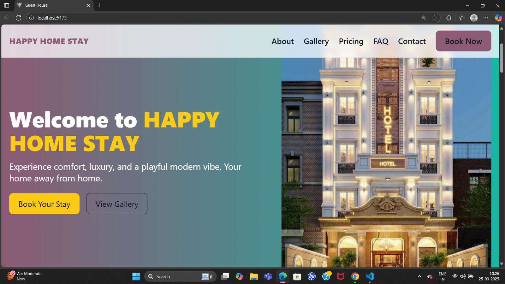
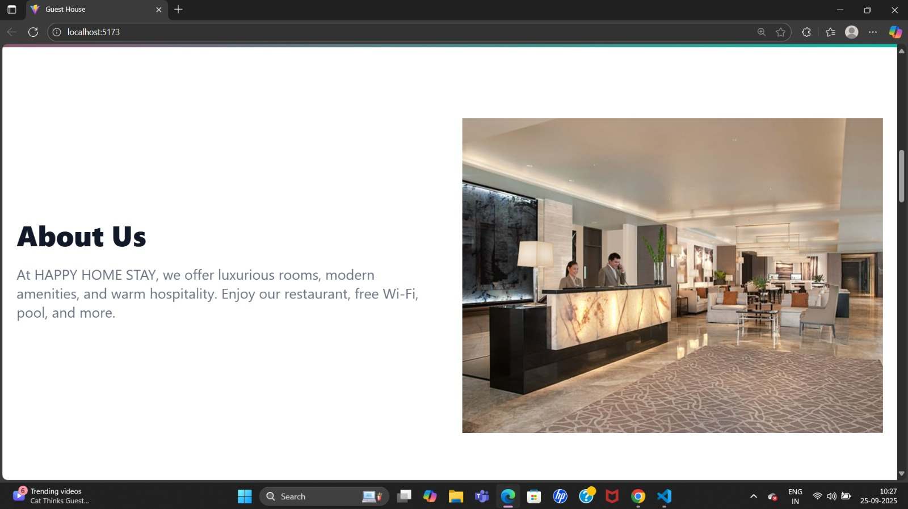
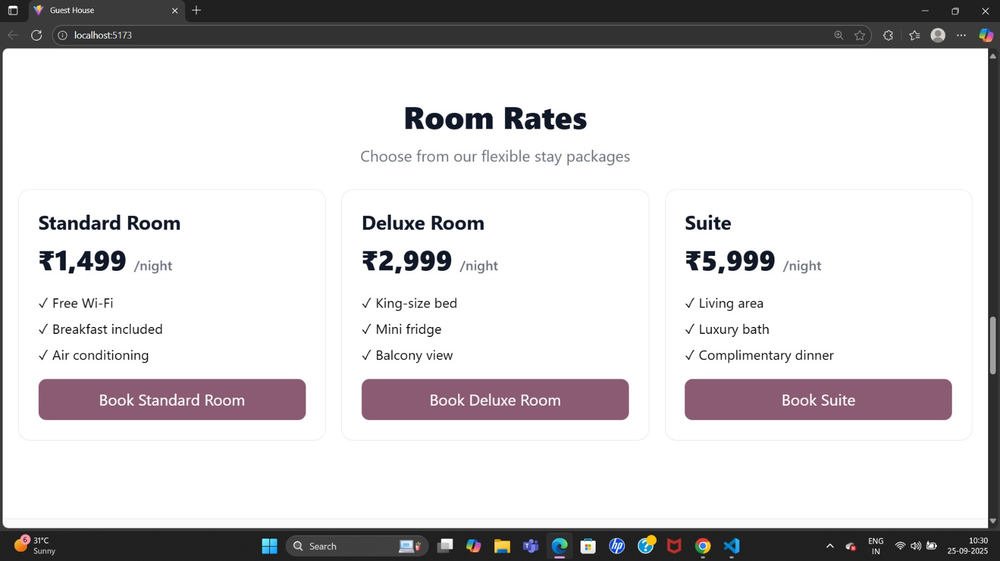

# 🏡 HAPPY HOME STAY — Guest House Landing

> A simple, responsive React + Vite landing site for **HAPPY HOME STAY** — a small guest-house / homestay landing page showcasing hero, rooms, gallery, pricing, FAQ and contact sections.

---

## 📌 Overview

This repository contains a single-page React site built with Vite.  
It's designed as a lightweight, component-based landing site with:

- Hero / CTA
- About section
- Image gallery
- Pricing / room cards
- FAQ (accordion)
- Contact form + map
- Navbar & Footer

---

## 📸 Project Screenshots

<p align="center">
  
  
</p>
<p align="center">
  
  
</p>

---

## ✨ Key Features

- ✅ Component-driven React structure (Navbar, Hero, About, Gallery, Pricing, FAQ, Contact, Footer)  
- 🎨 Per-component CSS for easy styling & customization  
- 📱 Responsive layout — mobile-friendly by default  
- 🚀 Built with Vite for a fast dev experience

---

## 🛠️ Tech Stack

- **React** (JSX components)  
- **Vite** (dev server + build)  
- **HTML / CSS** (component-level CSS files)  
- **Static images** for gallery & hero

---

## 🚀 Quick Start

**Prerequisites**
- Node.js v16+ (or latest LTS)
- npm or yarn

**Install & Run (dev)**

```bash
# from repository root (where package.json is)
npm install
npm run dev
```

---

## 📁 Project Structure

```
Guest-House/
├── index.html
├── package.json
├── vite.config.js
├── main.jsx
├── App.jsx
├── Website.jsx
├── About.jsx
├── About.css
├── Navbar.jsx
├── Navbar.css
├── Hero.jsx
├── Hero.css
├── Gallery.jsx
├── Gallery.css
├── Pricing.jsx
├── Pricing.css
├── FAQ.jsx
├── FAQ.css
├── Contact.jsx
├── Contact.css
├── Footer.jsx
├── Footer.css
├── index.css
├── images/
│   ├── hero.jpg
│   ├── room1.jpg
│   └── ...
└── README.md
```

---

## 🔧 How the Code Is Organized (Components)

- Navbar.jsx / Navbar.css — top navigation & mobile menu
- Hero.jsx / Hero.css — large banner + call-to-action
- About.jsx / About.css — short property description
- Gallery.jsx / Gallery.css — image gallery grid
- Pricing.jsx / Pricing.css — room cards & pricing info
- FAQ.jsx / FAQ.css — common questions (accordion)
- Contact.jsx / Contact.css — contact form + map iframe
- Footer.jsx / Footer.css — footer with links & copyright
- App.jsx / Website.jsx / main.jsx — app entry and layout

---

